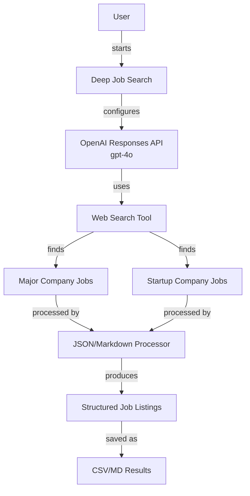

# Deep Job Search

An OpenAI-powered tool for finding software engineering jobs in video/streaming companies.

## Using This Tool

This tool uses the OpenAI Responses API with web search capabilities to efficiently find job listings for software engineering roles in the video and streaming industry.

You can run the application using the provided script:

```bash
# Run with default settings
./build-and-run.sh

# Quick sample run with minimal jobs
./build-and-run.sh --sample
```

The application automatically uses Docker for consistent execution across environments.

## System Architecture



The system uses the OpenAI Responses API with web search to:

1. Search for jobs at major companies in the video/streaming industry
2. Search for jobs at startup companies in the video/streaming industry
3. Structure and validate job information
4. Output results in CSV and Markdown formats

## Project Structure

The project consists of the following key files:

- **deep_job_search.py** - Main Python script implementing the job search using OpenAI's Responses API
- **api_wrapper.py** - Utility wrapper for OpenAI API calls with logging and timing metrics. Provides consistent error handling and statistics tracking.
- **logger_utils.py** - Enhanced logging utility for detailed execution tracking, with features for nested operations, API call logging, and timing analysis.
- **agent_visualizer.py** - Visualization tool that generates diagrams and reports showing API call flow and token usage.
- **build-and-run.sh** - Main script for building and running the Docker container. This is the primary entry point for running the application.
- **run.sh** - Simple alias to build-and-run.sh for backward compatibility. Only maintained for scripts that might reference it.
- **Dockerfile** - Docker configuration for containerizing the application
- **requirements.txt** - Python dependencies
- **container_setup.md** - Documentation for Docker container setup
- **roles_200.csv/md** - Reference data for job roles
- **jobbot_costs.png** - Chart visualizing cost comparison between different OpenAI models for running searches with 200 roles

The application produces output in two locations:
- **results/** - Contains job search results in CSV and Markdown formats
- **logs/** - Contains detailed execution logs and API call information

## Docker Support

The application is designed to run in Docker to ensure consistent execution across environments. The `build-and-run.sh` script handles all Docker operations automatically:

```bash
# Build and run with Docker (first time or with --rebuild flag)
./build-and-run.sh

# Run with specific options
./build-and-run.sh --sample --model gpt-4o
```

For more details about the Docker setup, see [container_setup.md](container_setup.md).

## CLI Options

```
usage: ./build-and-run.sh [options]

Main options:
  --help                show this help message and exit
  --majors N            Number of major company jobs to find
  --startups N          Number of startup company jobs to find
  --sample              Run with minimal settings (2 major, 2 startup jobs)
  --log-level LEVEL     Logging level (default: INFO)
  --log-file FILE       Log to this file in addition to console
  --force               Skip cost confirmation prompt
  --budget BUDGET       Maximum cost in USD (exit if exceeded)
  --company-list-limit  Maximum number of companies to display in prompts
  --use-web-verify      Use web search for URL verification (limited implementation)
  --rebuild             Force rebuild of the Docker image
  --visualize           Generate visualization diagrams (default: True)
  --no-visualize        Disable visualization generation

Model options:
  --model MODEL         Model for Responses API implementation (default: gpt-4o)
```

> **Note:** The `--use-web-verify` option is included for future expansion but currently has limited implementation. It's intended to verify job URLs via web search but this functionality is not fully integrated.

## Performance Optimization

### Model Selection for Cost/Performance Balance

Different models offer varying balances of cost, speed, and quality:

```bash
# Economy mode - Lowest cost (~$0.008 per run)
./build-and-run.sh --model gpt-3.5-turbo

# Standard mode - Good balance (~$0.03 per run)
./build-and-run.sh --model gpt-4o

# Performance mode - Highest quality (~$0.08 per run)
./build-and-run.sh --model gpt-4.1
```

### Sample Mode for Development

When developing or testing the system, use sample mode for faster, cheaper runs:

```bash
# Sample mode with only 2 major and 2 startup jobs
./build-and-run.sh --sample

# Sample mode with a specific model
./build-and-run.sh --sample --model gpt-3.5-turbo
```

### Logging Configuration for Debugging

Adjust logging for different needs:

```bash
# Minimal logging for production
./build-and-run.sh --log-level WARNING

# Standard logging
./build-and-run.sh --log-level INFO

# Verbose logging for debugging
./build-and-run.sh --log-level DEBUG

# Custom log file
./build-and-run.sh --log-file custom_log.txt
```

### Budget Control

Set explicit budget controls:

```bash
# Set a maximum budget of $0.10
./build-and-run.sh --budget 0.10

# Skip the cost confirmation prompt
./build-and-run.sh --force

# Estimate costs without running
JOBBOT_ESTIMATE_ONLY=1 ./build-and-run.sh
```

## Cost Estimation

The application uses the OpenAI Responses API with the following pricing tiers:

| Model | Price per 1K tokens | Typical Usage | Estimated Cost |
|-------|---------------------|---------------|----------------|
| gpt-4o | $0.005 | ~8K tokens | $0.04 |
| gpt-4o-mini | $0.002 | ~8K tokens | $0.016 |
| gpt-3.5-turbo | $0.001 | ~8K tokens | $0.008 |

Actual costs will vary based on:
- Number of jobs searched (controlled by `--majors` and `--startups` flags)
- Complexity of search results
- The model used (controlled by `--model` flag)

To control costs, you can:
- Limit the number of major/startup jobs with `--majors` and `--startups` flags
- Use less expensive models with the `--model` flag
- Set a token usage limit with `--max-tokens`

The `jobbot_costs.png` file visualizes the cost differences between models for a standard 200-role search.

### Cost Comparison Examples

| Configuration | Estimated Cost |
|---------------|----------------|
| Default (10+10 jobs) | $0.04 |
| Economy mode (--model gpt-3.5-turbo) | $0.008 |
| Sample mode (2+2 jobs) | $0.016 |
| Premium mode (--model gpt-4.1) | $0.08 |

## Results

Results are saved in the `results` directory as both CSV and Markdown files. Logs are saved in the `logs` directory.

## Requirements

- Docker
- OpenAI API key

## Installation

### Prerequisites

- Docker
- OpenAI API Key

### Setup

Clone this repository:

```bash
git clone <repository-url>
cd deep-job-search
```

Create a `.env` file with your OpenAI API key:

```
OPENAI_API_KEY=your_api_key_here
```

## Usage Examples

### Basic Usage

```bash
# Default settings (10 major company and 10 startup jobs)
./build-and-run.sh

# Quick sample run (2 major and 2 startup jobs)
./build-and-run.sh --sample

# Custom job counts
./build-and-run.sh --majors 20 --startups 10

# Limit company list length in prompts
./build-and-run.sh --company-list-limit 5
```

### Model Selection

```bash
# Use different models for different use cases
./build-and-run.sh --model gpt-4o           # Default (balanced)
./build-and-run.sh --model gpt-4o-mini      # Economy (faster, cheaper)
./build-and-run.sh --model gpt-4.1          # Premium (highest quality)
./build-and-run.sh --model gpt-3.5-turbo    # Lowest cost option
```

### Logging and Debugging

```bash
# Run with verbose logging
./build-and-run.sh --log-level DEBUG

# Save logs to a specific file
./build-and-run.sh --log-file custom_log.txt

# Enable trace output for detailed execution tracking
./build-and-run.sh --trace
```

### Visualization

The tool automatically generates visualization diagrams showing API calls, token usage, and process flow:

```bash
# Run with visualization enabled (default)
./build-and-run.sh

# Disable visualization for faster execution
./build-and-run.sh --no-visualize
```

Visualization files are saved to the `logs/visuals` directory:
- **Timeline diagrams**: Show when each API call was made and how long it took
- **Execution reports**: Contain detailed information about token usage and API calls

### Cost Management

```bash
# Set token limit for tighter cost control
./build-and-run.sh --max-tokens 50000

# Skip confirmation prompt
./build-and-run.sh --force

# Set a maximum budget
./build-and-run.sh --budget 0.10
```

### Docker Management

```bash
# Force rebuild of Docker image
./build-and-run.sh --rebuild

# Run sample mode with rebuild
./build-and-run.sh --sample --rebuild
```

### Environment Variables

You can set these environment variables:

```bash
# Skip confirmation prompts
export JOBBOT_SKIP_CONFIRM=1

# Exit after cost estimation
export JOBBOT_ESTIMATE_ONLY=1

# Run with specified variables
JOBBOT_SKIP_CONFIRM=1 ./build-and-run.sh
```

## Output

Results are saved in the `results` directory:

- `job_results.csv` - CSV format suitable for spreadsheet applications
- `job_results.md` - Markdown format for easy viewing

Each result includes:
- Job number (#)
- Job title
- Company name
- Company type (Major/Startup)
- Job URL

### Example Output

CSV format:
```csv
#,title,company,type,url
1,Senior Software Engineer,Netflix,Major,https://netflix.com/jobs/123
2,Backend Developer,Mux,Startup,https://mux.com/careers/456
```

Markdown format:
```markdown
# Job Search Results

Found 2 jobs.

|   # | title                   | company   | type   | url                           |
|-----|-------------------------|-----------|--------|-------------------------------|
|   1 | Senior Software Engineer | Netflix   | Major  | https://netflix.com/jobs/123 |
|   2 | Backend Developer       | Mux       | Startup | https://mux.com/careers/456  |
```

## Troubleshooting

### API Key Issues

- Ensure your OPENAI_API_KEY is set correctly in the .env file
- Verify your API key has access to the model you're trying to use

```bash
# Test your API key
echo $OPENAI_API_KEY
```

### Connection Issues

- Check your internet connection
- Increase logging with `--log-level DEBUG` to see detailed error messages

```bash
# Check Docker container access to the internet
./build-and-run.sh --log-level DEBUG
```

### Model Availability

If you encounter errors about model availability:

```bash
# Try using a more widely available model
./build-and-run.sh --model gpt-4o
```

### Docker Issues

If Docker isn't working properly:

```bash
# Force rebuild the Docker image
./build-and-run.sh --rebuild

# Check Docker status
docker info
```

## Advanced Configuration

### Fine-tuning the Search

You can adjust how the search works by modifying the query formation in `deep_job_search.py`:

```python
query = f"""
I need you to find {count} software engineering job listings at major companies in the video/streaming industry.

Focus on these companies: {companies}
Look for roles with keywords like: {keywords}

For each job listing, I need:
1. The exact job title
2. The company name
3. The direct URL to the job posting (not a careers page)

Return the results as a structured JSON array with fields: title, company, url, type
"""
```

### Customizing Output Formats

By default, results are saved in two formats:
1. **CSV** (`job_results.csv`): Excel and spreadsheet compatible
2. **Markdown** (`job_results.md`): GitHub and documentation friendly

You can customize the format by modifying the `save()` function in `deep_job_search.py`.

## License

[MIT License](LICENSE)
