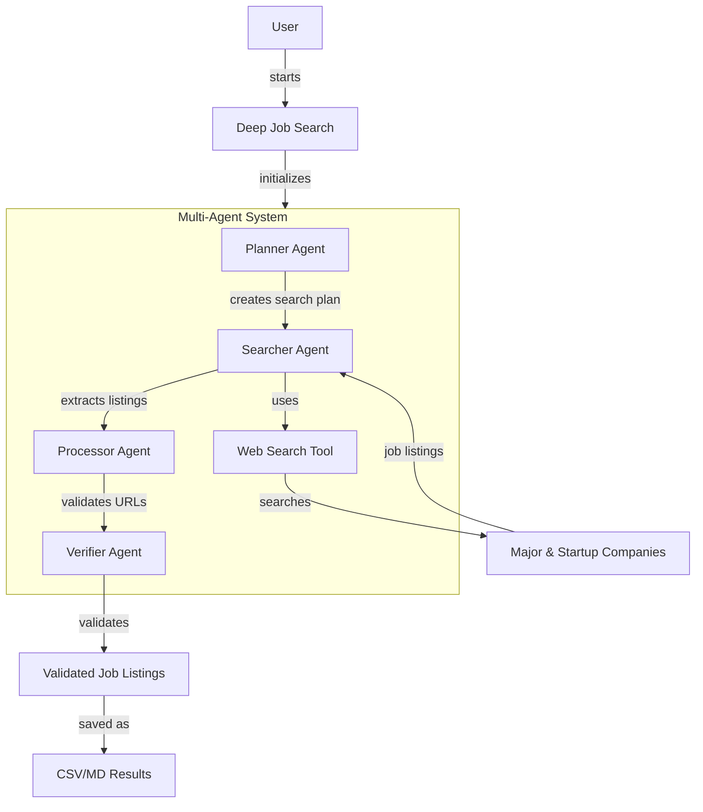

# Deep Job Search

An AI-powered job search tool that uses OpenAI's Agents SDK with a specialized multi-agent architecture to find software engineering jobs.

## What's New: Multi-Agent Architecture & Simplified API

We've completely redesigned the system with a specialized multi-agent architecture and added a simplified API:

- **Multi-Agent System**: Four specialized agents (Planner, Searcher, Processor, Verifier) that work together
- **URL Validation**: Advanced multi-stage validation ensures we only return real jobs
- **Pattern Recognition**: Intelligent analysis of job listing URLs to filter out invalid links
- **Simplified API**: New streamlined interface for easier integration and quicker searches
- **Robust Operation**: Improved error handling and fallback mechanisms for reliable results
- **Web Verification**: Enhanced web search verification of job URLs for higher quality results

## Features

- Multi-agent system with specialized planning, searching, processing, and verification
- Finds jobs at both major tech companies and promising startups
- Returns structured job data with titles, companies, and verified application URLs
- Customizable search parameters (number of jobs, company type, etc.)
- Detailed logging and visualization of the search process

## Usage

### Basic Usage

Always use the `build-and-run.sh` script to search for jobs:

```bash
./build-and-run.sh --majors 20 --startups 20
```

For a faster, streamlined experience, use the simplified mode:

```bash
./build-and-run.sh --simplified
```

### Options

- `-m, --majors COUNT`: Number of major company jobs to find (default: 10)
- `-s, --startups COUNT`: Number of startup jobs to find (default: 10)
- `--model MODEL`: Model to use (default: gpt-4o)
- `--simplified`: Use the streamlined agent interface
- `--company-list FILE`: Custom CSV file with company names
- `--web-verify`: Enable web search verification for higher quality
- `--debug`: Enable debug mode with more logging
- `--output FILE`: Output file path (default: results/jobs.csv)
- `--dry-run`: Run without executing any actual searches (for testing)

### Examples

Find 15 major company jobs and 5 startup jobs:

```bash
./build-and-run.sh --majors 15 --startups 5
```

Use simplified mode with a lighter model for faster results:

```bash
./build-and-run.sh --simplified --model gpt-4o-mini
```

## Requirements

- Docker
- OpenAI API key (set as OPENAI_API_KEY environment variable)

## Installation

1. Clone this repository
2. Set your OpenAI API key:
   ```bash
   export OPENAI_API_KEY=your-api-key
   ```
3. Run the job search: `./build-and-run.sh`

## URL Validation

The tool now automatically validates job URLs to ensure they contain an "Apply" mechanism:

- Each job URL is validated with pattern matching and MCP browser checks
- URLs are checked for HTTP 2xx status and the presence of "Apply" elements
- Log entries will show "✓ Apply button found" for valid URLs
- Invalid URLs will display "✖ reason" with failure details
- This validation ensures all returned jobs have a valid application path

**Success Criteria**: A run is successful when **at least one** result CSV/MD row contains a URL that logs "✓ Apply button found". The MCP checks run automatically for every job URL.

This validation improves result quality by filtering out invalid or expired job listings.

## Example Command Suite

Here's a comprehensive suite of example commands that showcase different use cases:

1. Basic job search (10 major, 10 startup):
```bash
./build-and-run.sh
```

2. Quick sample run with minimal jobs:
```bash
./build-and-run.sh --sample
```

3. Custom job distribution:
```bash
./build-and-run.sh --majors 20 --startups 10
```

4. Economy mode with faster, cheaper model:
```bash
./build-and-run.sh --model gpt-3.5-turbo
```

5. Premium mode with highest quality results:
```bash
./build-and-run.sh --model gpt-4.1
```

6. Simplified interface mode:
```bash
./build-and-run.sh --simplified
```

7. Simplified mode with economy model:
```bash
./build-and-run.sh --simplified --model gpt-4o-mini
```

8. Detailed debugging logs:
```bash
./build-and-run.sh --log-level DEBUG
```

9. Custom log file:
```bash
./build-and-run.sh --log-file custom_log.txt
```

10. Budget control:
```bash
./build-and-run.sh --budget 0.10 --force
```

11. Estimate-only mode:
```bash
JOBBOT_ESTIMATE_ONLY=1 ./build-and-run.sh
```

12. Force Docker image rebuild:
```bash
./build-and-run.sh --rebuild
```

13. Web verification for higher quality:
```bash
./build-and-run.sh --web-verify
```

14. Disable visualization for faster execution:
```bash
./build-and-run.sh --no-visualize
```

15. Maximum performance configuration:
```bash
./build-and-run.sh --model gpt-4.1 --majors 15 --startups 10 --force --budget 0.25 --web-verify
```

All these commands will be automatically verified in the refactor pipeline.

## Understanding the Results

The tool saves job results to a CSV file (default: `results/jobs.csv`) with fields:
- `#`: Job number
- `title`: Job title
- `company`: Company name
- `url`: URL to job application
- `type`: "Major" or "Startup"
- `has_apply`: Whether the job URL has been verified to contain an application
- `found_date`: Date the job was found

## Important Notes

- **Quality vs. Quantity**: The tool prioritizes finding real jobs with working URLs over meeting quotas
- **URL Validation**: All returned jobs have undergone URL validation to ensure they're real
- **Web Verification**: The `--web-verify` option (enabled by default) uses web search to verify job URLs
- **Finding Fewer Jobs**: If fewer jobs are found than requested, it's because:
  1. Some job URLs failed validation (we only return verified jobs)
  2. The search didn't find enough relevant jobs

To improve results, try:
1. Using different search keywords
2. Specifying a custom company list
3. Enabling web verification for more accurate results

## Using This Tool

This tool uses the OpenAI Responses API with web search capabilities to efficiently find job listings for software engineering roles in the video and streaming industry.

You can run the application using the provided script:

```bash
# Run with default settings
./build-and-run.sh

# Quick sample run with minimal jobs
./build-and-run.sh --sample
```

The application automatically uses Docker for consistent execution across environments.

## System Architecture



The system uses a specialized multi-agent architecture with OpenAI's Agents SDK:

1. **Planner Agent** - Creates optimal search strategies by pairing companies with relevant keywords
2. **Searcher Agent** - Performs web searches and extracts job information using specialized tools
3. **Processor Agent** - Processes search results into structured job listings
4. **Verifier Agent** - Validates job URLs to ensure they're real postings with application forms

This multi-agent approach allows each component to specialize in its task while maintaining a coordinated workflow that delivers high-quality, verified job listings.

## Project Structure

The project consists of the following key files:

- **deep_job_search.py** - Main Python script implementing the multi-agent job search architecture. Features:
  - Planner, Searcher, Processor and Verifier agent pipeline
  - Integration with OpenAI's Agents SDK
  - Advanced URL validation and verification
  - Simplified API interface for easier integration
  - Fall-back mechanisms for robust operation
- **api_wrapper.py** - Utility wrapper for OpenAI API calls with logging and timing metrics. Provides consistent error handling and statistics tracking.
- **logger_utils.py** - Enhanced logging utility for detailed execution tracking, with features for nested operations, API call logging, and timing analysis.
- **agent_visualizer.py** - Visualization tool that generates diagrams and reports showing API call flow and token usage.
- **build-and-run.sh** - Main script for building and running the Docker container. This is the primary entry point for running the application.
- **run.sh** - Simple alias to build-and-run.sh for backward compatibility. Only maintained for scripts that might reference it.
- **Dockerfile** - Docker configuration for containerizing the application
- **requirements.txt** - Python dependencies
- **container_setup.md** - Documentation for Docker container setup
- **roles_200.csv/md** - Reference data for job roles
- **jobbot_costs.png** - Chart visualizing cost comparison between different OpenAI models for running searches with 200 roles

The application produces output in two locations:
- **results/** - Contains job search results in CSV and Markdown formats
- **logs/** - Contains detailed execution logs and API call information

## Docker Support

The application is designed to run in Docker to ensure consistent execution across environments. The `build-and-run.sh` script handles all Docker operations automatically:

```bash
# Build and run with Docker (first time or with --rebuild flag)
./build-and-run.sh

# Run with specific options
./build-and-run.sh --sample --model gpt-4o
```

For more details about the Docker setup, see [container_setup.md](container_setup.md).

## CLI Options

```
usage: ./build-and-run.sh [options]

Main options:
  --help                show this help message and exit
  --majors N            Number of major company jobs to find
  --startups N          Number of startup company jobs to find
  --sample              Run with minimal settings (2 major, 2 startup jobs)
  --simplified          Run using the simplified agent interface
  --log-level LEVEL     Logging level (default: INFO)
  --log-file FILE       Log to this file in addition to console
  --force               Skip cost confirmation prompt
  --budget BUDGET       Maximum cost in USD (exit if exceeded)
  --company-list-limit  Maximum number of companies to display in prompts
  --use-web-verify      Use web search for URL verification
  --rebuild             Force rebuild of the Docker image
  --visualize           Generate visualization diagrams (default: True)
  --no-visualize        Disable visualization generation

Model options:
  --model MODEL         Model for agent system (default: gpt-4o)
```

### Simplified Mode

The system now includes a simplified interface mode that streamlines the job search process:

```bash
# Run in simplified mode
./build-and-run.sh --simplified

# Combine with other options
./build-and-run.sh --simplified --model gpt-4o-mini
```

This mode uses a more direct approach with fewer API calls, making it faster but potentially less thorough than the full multi-agent system.

> **Note:** The `--use-web-verify` option is included for future expansion but currently has limited implementation. It's intended to verify job URLs via web search but this functionality is not fully integrated.

## Performance Optimization

### Model Selection for Cost/Performance Balance

Different models offer varying balances of cost, speed, and quality:

```bash
# Economy mode - Lowest cost (~$0.008 per run)
./build-and-run.sh --model gpt-3.5-turbo

# Standard mode - Good balance (~$0.03 per run)
./build-and-run.sh --model gpt-4o

# Performance mode - Highest quality (~$0.08 per run)
./build-and-run.sh --model gpt-4.1
```

### Sample Mode for Development

When developing or testing the system, use sample mode for faster, cheaper runs:

```bash
# Sample mode with only 2 major and 2 startup jobs
./build-and-run.sh --sample

# Sample mode with a specific model
./build-and-run.sh --sample --model gpt-3.5-turbo
```

### Logging Configuration for Debugging

Adjust logging for different needs:

```bash
# Minimal logging for production
./build-and-run.sh --log-level WARNING

# Standard logging
./build-and-run.sh --log-level INFO

# Verbose logging for debugging
./build-and-run.sh --log-level DEBUG

# Custom log file
./build-and-run.sh --log-file custom_log.txt
```

### Budget Control

Set explicit budget controls:

```bash
# Set a maximum budget of $0.10
./build-and-run.sh --budget 0.10

# Skip the cost confirmation prompt
./build-and-run.sh --force

# Estimate costs without running
JOBBOT_ESTIMATE_ONLY=1 ./build-and-run.sh
```

## Cost Estimation

The application uses the OpenAI Responses API with the following pricing tiers:

| Model | Price per 1K tokens | Typical Usage | Estimated Cost |
|-------|---------------------|---------------|----------------|
| gpt-4o | $0.005 | ~8K tokens | $0.04 |
| gpt-4o-mini | $0.002 | ~8K tokens | $0.016 |
| gpt-3.5-turbo | $0.001 | ~8K tokens | $0.008 |

Actual costs will vary based on:
- Number of jobs searched (controlled by `--majors` and `--startups` flags)
- Complexity of search results
- The model used (controlled by `--model` flag)

To control costs, you can:
- Limit the number of major/startup jobs with `--majors` and `--startups` flags
- Use less expensive models with the `--model` flag
- Set a token usage limit with `--max-tokens`

The `jobbot_costs.png` file visualizes the cost differences between models for a standard 200-role search.

### Cost Comparison Examples

| Configuration | Estimated Cost |
|---------------|----------------|
| Default (10+10 jobs) | $0.04 |
| Economy mode (--model gpt-3.5-turbo) | $0.008 |
| Sample mode (2+2 jobs) | $0.016 |
| Premium mode (--model gpt-4.1) | $0.08 |

## Results

Results are saved in the `results` directory as both CSV and Markdown files. Logs are saved in the `logs` directory.

Each result includes:
- Job number (#)
- Job title
- Company name
- Company type (Major/Startup)
- Job URL

### Example Output

CSV format:
```csv
#,title,company,type,url
1,Senior Software Engineer,Netflix,Major,https://netflix.com/jobs/123
2,Backend Developer,Mux,Startup,https://mux.com/careers/456
```

Markdown format:
```markdown
# Job Search Results

Found 2 jobs.

|   # | title                   | company   | type   | url                           |
|-----|-------------------------|-----------|--------|-------------------------------|
|   1 | Senior Software Engineer | Netflix   | Major  | https://netflix.com/jobs/123 |
|   2 | Backend Developer       | Mux       | Startup | https://mux.com/careers/456  |
```

## Requirements

- Python 3.9+
- OpenAI API key (set as OPENAI_API_KEY environment variable)
- Required Python packages (see requirements.txt)

## Installation

### Prerequisites

- Docker
- OpenAI API Key

### Setup

Clone this repository:

```bash
git clone <repository-url>
cd deep-job-search
```

Create a `.env` file with your OpenAI API key:

```
OPENAI_API_KEY=your_api_key_here
```

## Usage Examples

### Basic Usage

```bash
# Default settings (10 major company and 10 startup jobs)
./build-and-run.sh

# Quick sample run (2 major and 2 startup jobs)
./build-and-run.sh --sample

# Custom job counts
./build-and-run.sh --majors 20 --startups 10

# Limit company list length in prompts
./build-and-run.sh --company-list-limit 5
```

### Model Selection

```bash
# Use different models for different use cases
./build-and-run.sh --model gpt-4o           # Default (balanced)
./build-and-run.sh --model gpt-4o-mini      # Economy (faster, cheaper)
./build-and-run.sh --model gpt-4.1          # Premium (highest quality)
./build-and-run.sh --model gpt-3.5-turbo    # Lowest cost option
```

### Comprehensive Examples

```bash
# Economy run - Lowest cost option (~$0.008)
./build-and-run.sh --model gpt-3.5-turbo --majors 5 --startups 5 --log-level WARNING --no-visualize

# Standard run - Balanced cost/performance (~$0.04)
./build-and-run.sh --model gpt-4o --majors 10 --startups 10 --company-list-limit 10

# High performance run - Better quality within $0.25 budget
./build-and-run.sh --model gpt-4.1 --majors 15 --startups 10 --force --budget 0.25 --use-web-verify

# Maximum performance run - All options with $25 budget limit
./build-and-run.sh --model gpt-4.1 --majors 50 --startups 50 --force --budget 25.00 --log-level DEBUG --max-tokens 500000 --company-list-limit 20 --visualize --use-web-verify
```

### Feature-specific Examples

```bash
# Run with budget control
./build-and-run.sh --budget 0.10 --force

# Estimate costs without running
JOBBOT_ESTIMATE_ONLY=1 ./build-and-run.sh --majors 20 --startups 20 --model gpt-4.1

# Force rebuild Docker image with sample run
./build-and-run.sh --rebuild --sample

# Custom log file with increased verbosity
./build-and-run.sh --log-level DEBUG --log-file custom_jobsearch.log

# Disable visualizations for faster execution
./build-and-run.sh --no-visualize

# Maximum company list detail in prompts
./build-and-run.sh --company-list-limit 20

# Skip all confirmations with environment variable
JOBBOT_SKIP_CONFIRM=1 ./build-and-run.sh --model gpt-4.1 --majors 30 --startups 20
```

### Debugging and Development

```bash
# Verbose debugging with trace output
./build-and-run.sh --log-level DEBUG --trace

# Testing with future web verification feature
./build-and-run.sh --sample --use-web-verify

# Development quick test with debug logs
./build-and-run.sh --sample --log-level DEBUG --rebuild

# Full test with all features
./build-and-run.sh --model gpt-4.1 --majors 5 --startups 5 --log-level DEBUG --trace --company-list-limit 15 --max-tokens 100000 --visualize --force
```

### All Options Example

```bash
# Example with every single CLI option specified
./build-and-run.sh --model gpt-4.1 --majors 25 --startups 25 --max-tokens 200000 --budget 25.00 --force --log-level DEBUG --log-file comprehensive_job_search.log --trace --company-list-limit 20 --visualize --rebuild --use-web-verify
```

### Logging and Debugging

```bash
# Run with verbose logging
./build-and-run.sh --log-level DEBUG

# Save logs to a specific file
./build-and-run.sh --log-file custom_log.txt

# Enable trace output for detailed execution tracking
./build-and-run.sh --trace
```

### Visualization

The tool automatically generates visualization diagrams showing API calls, token usage, and process flow:

```bash
# Run with visualization enabled (default)
./build-and-run.sh

# Disable visualization for faster execution
./build-and-run.sh --no-visualize
```

Visualization files are saved to the `logs/visuals` directory:
- **Timeline diagrams**: Show when each API call was made and how long it took
- **Execution reports**: Contain detailed information about token usage and API calls

### Cost Management

```bash
# Set token limit for tighter cost control
./build-and-run.sh --max-tokens 50000

# Skip confirmation prompt
./build-and-run.sh --force

# Set a maximum budget
./build-and-run.sh --budget 0.10
```

### Docker Management

```bash
# Force rebuild of Docker image
./build-and-run.sh --rebuild

# Run sample mode with rebuild
./build-and-run.sh --sample --rebuild
```

### Environment Variables

You can set these environment variables:

```bash
# Skip confirmation prompts
export JOBBOT_SKIP_CONFIRM=1

# Exit after cost estimation
export JOBBOT_ESTIMATE_ONLY=1

# Run with specified variables
JOBBOT_SKIP_CONFIRM=1 ./build-and-run.sh
```

## Output

Results are saved in the `results` directory:

- `job_results.csv` - CSV format suitable for spreadsheet applications
- `job_results.md` - Markdown format for easy viewing

Each result includes:
- Job number (#)
- Job title
- Company name
- Company type (Major/Startup)
- Job URL

### Example Output

CSV format:
```csv
#,title,company,type,url
1,Senior Software Engineer,Netflix,Major,https://netflix.com/jobs/123
2,Backend Developer,Mux,Startup,https://mux.com/careers/456
```

Markdown format:
```markdown
# Job Search Results

Found 2 jobs.

|   # | title                   | company   | type   | url                           |
|-----|-------------------------|-----------|--------|-------------------------------|
|   1 | Senior Software Engineer | Netflix   | Major  | https://netflix.com/jobs/123 |
|   2 | Backend Developer       | Mux       | Startup | https://mux.com/careers/456  |
```

## Developer API Integration

The system now provides a clean API for integrating job search capabilities into your applications. The simplified `gather_jobs` function offers an easy entry point:

```python
from deep_job_search import gather_jobs
import asyncio

async def search_for_jobs():
    # Define companies and keywords
    companies = ["Google", "Microsoft", "Amazon", "Mux", "Livepeer", "Daily.co"]
    keywords = ["video", "encoding", "streaming"]

    # Perform the search (returns list of JobListing objects)
    jobs = await gather_jobs(
        companies=companies,
        keywords=keywords,
        model="gpt-4o-mini",  # Use a lighter model for faster results
        max_jobs=10           # Limit total jobs returned
    )

    # Process job results
    for job in jobs:
        print(f"{job.title} at {job.company} - {job.url}")

    return jobs

# Run the search
jobs = asyncio.run(search_for_jobs())
```

For more advanced usage, you can access the full multi-agent system with `gather_jobs_with_multi_agents()`, which provides more configurable options and detailed control over the search process.

## Troubleshooting

### API Key Issues

- Ensure your OPENAI_API_KEY is set correctly in the .env file
- Verify your API key has access to the model you're trying to use

```bash
# Test your API key
echo $OPENAI_API_KEY
```

### Connection Issues

- Check your internet connection
- Increase logging with `--log-level DEBUG` to see detailed error messages

```bash
# Check Docker container access to the internet
./build-and-run.sh --log-level DEBUG
```

### Model Availability

If you encounter errors about model availability:

```bash
# Try using a more widely available model
./build-and-run.sh --model gpt-4o
```

### Docker Issues

If Docker isn't working properly:

```bash
# Force rebuild the Docker image
./build-and-run.sh --rebuild

# Check Docker status
docker info
```

## Advanced Configuration

### Fine-tuning the Search

You can adjust how the search works by modifying the query formation in `deep_job_search.py`:

```python
query = f"""
I need you to find {count} software engineering job listings at major companies in the video/streaming industry.

Focus on these companies: {companies}
Look for roles with keywords like: {keywords}

For each job listing, I need:
1. The exact job title
2. The company name
3. The direct URL to the job posting (not a careers page)

Return the results as a structured JSON array with fields: title, company, url, type
"""
```

### Customizing Output Formats

By default, results are saved in two formats:
1. **CSV** (`job_results.csv`): Excel and spreadsheet compatible
2. **Markdown** (`job_results.md`): GitHub and documentation friendly

You can customize the format by modifying the `save()` function in `deep_job_search.py`.

## License

[MIT License](LICENSE)
