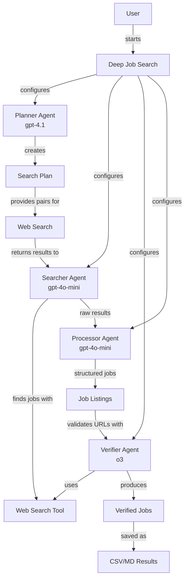

# Deep Job Search

An OpenAI Agents-powered tool for finding software engineering jobs in video/streaming companies.

## System Architecture



This architecture leverages the OpenAI Agents SDK's powerful features:

- **Agent Handoffs**: Agents can delegate tasks to other agents. For example, the Searcher agent hands off to the Processor agent, which hands off to the Verifier agent.
- **Integrated Tools**: Agents use specialized tools like the WebSearchTool to find job listings on the internet.
- **Tracing and Visualization**: The agent interactions can be traced and visualized to understand how the system works.
- **Token Management**: Each agent's token usage is carefully tracked to ensure efficient resource allocation.

You can generate a visual representation of this architecture by running:

```bash
python visualize_agents.py
```

## How It Works

1. **Planning Phase**: The planner agent creates pairs of companies and keywords for searching
2. **Search Phase**: The searcher agent finds job listings using the OpenAI web search tool
3. **Processing Phase**: The processor agent extracts structured job information
4. **Verification Phase**: The verifier agent confirms URL validity and checks for apply buttons
5. **Results**: Valid job listings are saved to CSV and Markdown formats

## Cost Estimation

The application uses three different OpenAI models with different pricing tiers:

| Phase | Model | Price per 1K tokens | Typical Usage | Estimated Cost |
|-------|-------|---------------------|---------------|----------------|
| Planning | gpt-4.1 | $0.01 | ~5K tokens | $0.05 |
| Search | gpt-4o-mini | $0.002 | ~50K tokens | $0.10 |
| Verification | o3 | $0.0005 | ~20K tokens | $0.01 |
| **Total** | | | ~75K tokens | **$0.16** |

Actual costs will vary based on:
- Number of jobs searched
- Complexity of search results
- Number of verification steps needed
- Whether web verification is enabled (can increase verification costs by ~2-3x)

To control costs, you can:
- Limit the number of major/startup jobs with `--majors` and `--startups` flags
- Use smaller models with `--planner-model`, `--search-model`, and `--verifier-model` flags
- Set a token usage limit with `--max-tokens`
- Avoid web verification for standard searches (only use `--use-web-verify` when necessary)
- Use `--estimate-only` to see costs before running the full search

### Cost Comparison Examples

| Configuration | Estimated Cost |
|---------------|----------------|
| Default (100+100 jobs) | $0.16 |
| Economy models (--cheap) | $0.08 |
| Sample mode (10+10 jobs) | $0.03 |
| Premium models (--premium) | $0.25 |
| With web verification | $0.20-0.30 |

## Token Monitoring and Cost Control

The application includes robust token usage monitoring and cost control features:

### Pre-Execution Cost Estimation

```bash
# Get an estimate without running the full search
python deep_job_search.py --majors 50 --startups 50 --budget 0.25
```

Before starting the search, the application will:
1. Estimate the total tokens required across all phases
2. Calculate the estimated cost based on the models being used
3. Display this information to help you make informed decisions
4. Exit if the estimated cost exceeds your specified budget

### Dynamic Budget Management

The tool automatically:
- Allocates token budgets to each phase (planning, search, verification)
- Monitors token usage during execution
- Provides warnings when approaching budget limits
- Can terminate phases early to stay within budgets
- Displays detailed token usage statistics

### Budget Control Options

```bash
# Set a maximum budget (exit if estimated cost exceeds this value)
python deep_job_search.py --budget 0.25

# Run in sample mode for testing (10 major, 10 startup jobs)
python deep_job_search.py --sample

# Skip the cost confirmation prompt
python deep_job_search.py --force

# Set an environment variable to skip prompts in non-interactive environments
export JOBBOT_SKIP_CONFIRM=1
python deep_job_search.py
```

### Cost-Saving Configurations

```bash
# Economy mode - use cheapest models
python deep_job_search.py --planner-model gpt-4o-mini --search-model gpt-4o-mini --verifier-model o3

# Find fewer jobs (typically 1/5 the cost of the default)
python deep_job_search.py --majors 20 --startups 20

# Limit total token usage
python deep_job_search.py --max-tokens 50000
```

## Installation

### Prerequisites

- Python 3.11+
- OpenAI API Key with access to GPT-4.1 (for optimal results)
- Docker (optional, for containerized usage)

### Setup

Clone this repository and install dependencies:

```bash
git clone <repository-url>
cd deep-job-search
pip install -r requirements.txt
```

Create a `.env` file with your OpenAI API key:

```
OPENAI_API_KEY=your_api_key_here
```

## Usage

### CLI Options

```
usage: deep_job_search.py [-h] [--majors MAJORS] [--startups STARTUPS]
                         [--planner-model PLANNER_MODEL]
                         [--search-model SEARCH_MODEL]
                         [--verifier-model VERIFIER_MODEL]
                         [--log-level LOG_LEVEL] [--log-file LOG_FILE]
                         [--max-tokens MAX_TOKENS] [--force] [--budget BUDGET]
                         [--sample] [--use-web-verify] [--trace]

optional arguments:
  -h, --help            show this help message and exit
  --majors MAJORS       Number of major company jobs to find (default: 100)
  --startups STARTUPS   Number of startup jobs to find (default: 100)
  --planner-model PLANNER_MODEL
                        Model for planning (default: gpt-4.1)
  --search-model SEARCH_MODEL
                        Model for search/processing (default: gpt-4o-mini)
  --verifier-model VERIFIER_MODEL
                        Model for verification (default: o3)
  --log-level LOG_LEVEL
                        Logging level (default: INFO)
  --log-file LOG_FILE   Log to this file in addition to console
  --max-tokens MAX_TOKENS
                        Maximum tokens to use (default: 100000)
  --force               Skip cost confirmation prompt
  --budget BUDGET       Maximum cost in USD (will estimate and exit if exceeded)
  --sample              Run with minimal settings (10 major, 10 startup jobs) for testing
  --use-web-verify      Use web search for URL verification (slower but more accurate)
  --trace               Enable detailed agent tracing for debugging
```

### Run with Python

```bash
# Basic usage (finds up to 100 jobs for major companies and 100 for startups)
python deep_job_search.py

# Find fewer jobs (faster, cheaper)
python deep_job_search.py --majors 10 --startups 10

# Detailed logging
python deep_job_search.py --log-level DEBUG --log-file logs/search.log

# Use different models
python deep_job_search.py --planner-model gpt-4o --search-model gpt-3.5-turbo
```

### Run with Docker

Build and run using the provided script:

```bash
# Make the script executable
chmod +x build-and-run.sh

# Run with default settings
./build-and-run.sh

# Quick, low-cost sample run
./build-and-run.sh --quick

# Run with lowest-cost models
./build-and-run.sh --cheap

# Run with custom arguments
./build-and-run.sh --custom "--majors 10 --startups 10 --log-level DEBUG"
```

## Output

Results are saved in the `results` directory:

- `deep_job_results.csv` - CSV format suitable for spreadsheet applications
- `deep_job_results.md` - Markdown format for easy viewing on GitHub

Each result includes:
- Job number (#)
- Job title
- Company name
- Company type (Major/Startup)
- Job URL

## Troubleshooting

### API Key Issues

- Ensure your OPENAI_API_KEY is set correctly in the .env file
- Verify your API key has access to the models you're trying to use

### Connection Issues

- Check your internet connection
- Increase logging with `--log-level DEBUG` to see detailed error messages

### Quota Exceeded

- Use `--max-tokens` to limit token usage
- Use less expensive models with `--planner-model`, `--search-model`, and `--verifier-model`

### Verification Problems

#### Low Verification Success Rate

If you're getting few verified job listings:

```
Major verification results - Success: 10, Failed: 90
```

Try the following:

```bash
# Enable web search verification for more accurate results
python deep_job_search.py --use-web-verify

# Use a stronger model for verification
python deep_job_search.py --verifier-model gpt-4o --use-web-verify
```

#### Model Compatibility Issues

If you encounter errors like:

```
Error: The model 'o3' does not support the necessary capabilities for WebSearchTool
```

Either:
- Use a different model for verification: `--verifier-model gpt-4o-mini`
- Disable web verification: remove the `--use-web-verify` flag

### JSON Parsing Errors

If you see errors related to JSON parsing:

```
Error parsing job results: Expecting property name enclosed in double quotes
```

This usually indicates the AI generated invalid JSON. Try:
- Running again (results often vary)
- Using a more capable model: `--search-model gpt-4.1`
- Reducing the search scope: `--majors 50 --startups 50`

## Example Results

See [roles_200.md](roles_200.md) for an example of 200 discovered jobs.

## License

[MIT License](LICENSE)

## Usage Examples

### Basic Usage

```bash
# Default settings (100 major company and 100 startup jobs)
python deep_job_search.py

# Quick sample run (10 major and 10 startup jobs)
python deep_job_search.py --sample

# Custom job counts
python deep_job_search.py --majors 50 --startups 30
```

### Cost Management

```bash
# Estimate cost without running search
python deep_job_search.py --majors 50 --startups 50 --budget 0.25

# Economy mode with lowest-cost models
python deep_job_search.py --planner-model gpt-4o-mini --search-model gpt-4o-mini --verifier-model o3

# Premium mode with highest-quality models
python deep_job_search.py --planner-model gpt-4.1 --search-model gpt-4.1 --verifier-model gpt-4.1

# Set token limit for tighter cost control
python deep_job_search.py --max-tokens 50000
```

### Enhanced Verification

```bash
# Use web search for URL verification (more accurate but slower/costlier)
python deep_job_search.py --use-web-verify

# Economy run with web verification
python deep_job_search.py --sample --use-web-verify --planner-model gpt-4o-mini
```

### Debugging and Visualization

```bash
# Enable agent tracing for detailed debugging
python deep_job_search.py --sample --trace

# Generate a visualization of the agent architecture
python visualize_agents.py

# Generate a visualization and save to a specific path
python visualize_agents.py --output custom_graph
```

### Responses API Alternative

```bash
# Use the simpler Responses API implementation
python responses_job_search.py --majors 5 --startups 5

# Use a specific model with the Responses API
python responses_job_search.py --model gpt-4o-mini --majors 3 --startups 3
```

### Logging Options

```bash
# Debug level logging with file output
python deep_job_search.py --log-level DEBUG --log-file logs/search_debug.log

# Silent run (minimal console output)
python deep_job_search.py --log-level WARNING
```

### Docker Examples

```bash
# Basic Docker run with default settings
./build-and-run.sh

# Quick Docker run with minimal jobs
./build-and-run.sh --quick

# Docker run with economy models
./build-and-run.sh --cheap

# Docker run with premium models (highest quality)
./build-and-run.sh --premium

# Docker run with debug logging
./build-and-run.sh --debug

# Docker run with web verification
./build-and-run.sh --use-web-verify

# Docker run with custom arguments
./build-and-run.sh --custom "--majors 20 --startups 30 --log-level DEBUG"

# Estimate-only mode in Docker
./build-and-run.sh --estimate-only

# Docker run with budget cap
./build-and-run.sh --budget 0.25

# Rebuild Docker image and run
./build-and-run.sh --rebuild --quick
```

## Example Output

### Sample Cost Estimation

```
Estimated resource usage:
  - Tokens: ~45,000 tokens
  - Cost: ~$0.1200
```

### Sample Job Results

The CSV and Markdown files include detailed job information:

```
#,title,company,type,url
1,Senior Software Engineer – Streaming Platform,Netflix,Major,https://netflix.jobs/123456
2,Software Development Engineer – Live Events,Amazon Prime Video,Major,https://amazon.jobs/en/jobs/123456
3,Senior Backend Engineer – Video API,Mux,Startup,https://jobs.lever.co/mux/123456
```

### Troubleshooting Examples

#### Token Budget Issues

If you encounter token budget warnings:

```
TOKEN WARNING: Phase 'search' approaching its budget (4,000/5,000 tokens)
```

Solution:
```bash
# Increase the token budget
python deep_job_search.py --max-tokens 150000

# Or reduce job counts
python deep_job_search.py --majors 50 --startups 50
```

#### Verification Failures

If many jobs fail verification:

```
Failed to verify job URL: https://example.com/jobs/12345
Major verification results - Success: 5, Failed: 15
```

Solution:
```bash
# Enable web search verification for more accuracy
python deep_job_search.py --use-web-verify

# Pair with a stronger verification model
python deep_job_search.py --use-web-verify --verifier-model gpt-4o
```

#### Missing Dependencies

If markdown generation fails:

```
Could not save markdown table - tabulate package missing
```

Solution:
```bash
pip install tabulate==0.9.0
# Then run again
python deep_job_search.py
```

## Advanced Configuration

### Environment Variables

Set these in your `.env` file or environment:

```
# Required
OPENAI_API_KEY=your_api_key_here

# Optional
JOBBOT_SKIP_CONFIRM=1  # Skip all confirmation prompts
JOBBOT_ESTIMATE_ONLY=1 # Exit after cost estimation
```

### Output Formats

By default, results are saved in two formats:

1. **CSV** (deep_job_results.csv): Excel and spreadsheet compatible
2. **Markdown** (deep_job_results.md): GitHub and documentation friendly

Sample CSV format:
```csv
#,title,company,type,url
1,Senior Software Engineer,Netflix,Major,https://netflix.com/jobs/123
```

Sample Markdown format:
```markdown
# Deep Job Search Results

## 1. Senior Software Engineer at Netflix
- Type: Major
- URL: https://netflix.com/jobs/123
```

## Advanced Features

### Agent Visualization

Deep Job Search supports visualization of the agent workflow, which helps in understanding how the agents interact:

```bash
# Generate a visualization of the agent workflow
python visualize_agents.py
```

This generates a graph representation of the agent architecture, showing:
- How the planner, searcher, processor, and verifier agents connect
- Tool usage relationships
- Handoff flows between components


### Alternative Implementation: Responses API

As an alternative to the Agents SDK, you could implement Deep Job Search using OpenAI's Responses API, which offers:

- Simplified stateful conversations with the model
- Built-in tool usage with fewer round trips
- Support for web search in a single API call

Example of how the Responses API approach would simplify job searching:

```python
from openai import OpenAI

client = OpenAI()

# A single API call can handle the entire job search process
response = client.responses.create(
    model="gpt-4o",
    input="Find software engineering jobs at Netflix focused on video streaming",
    tools=[{"type": "web_search"}],
)

# The results include all the steps: search, processing, and verification
jobs = response.output[0].content[0].text
```

For the current implementation, we chose the Agents SDK for more granular control over the search process and token budgeting.

## Implementation Approaches

Deep Job Search offers two different implementation approaches:

### 1. Agents SDK Implementation (Main)

The primary implementation uses the OpenAI Agents SDK, which provides:
- Fine-grained control over each agent's behavior
- Detailed token usage monitoring and budgeting
- More explicit error handling and fallback mechanisms
- Support for agent visualization (see [Advanced Features](#advanced-features))

```bash
# Run the Agents SDK implementation (default)
python deep_job_search.py --majors 20 --startups 20
```

### 2. Responses API Implementation (Alternative)

An alternative implementation using the newer OpenAI Responses API is also provided, which offers:
- Simplified code with fewer moving parts
- Single API call instead of multiple round trips
- Stateful conversation handling by the API
- Less complex error handling

```bash
# Run the Responses API implementation
python responses_job_search.py --majors 5 --startups 5 --model gpt-4o
```

The Responses API implementation is simpler but currently offers less fine-grained control over token usage and less detailed error handling. It's a good option for simpler use cases or when you need to minimize code complexity.

## Debugging and Tracing

### Agent Tracing

The application supports detailed tracing of agent interactions for debugging purposes:

```bash
# Enable agent tracing
python deep_job_search.py --trace
```

When tracing is enabled, you'll see detailed information about each agent's actions:
- Agent input and output
- Tool calls and their results
- Token usage for each interaction
- Handoffs between agents

This is extremely helpful for:
- Debugging unexpected behavior
- Understanding how agents interact
- Optimizing prompts and instructions
- Identifying performance bottlenecks

Tracing output appears in the console by default.
